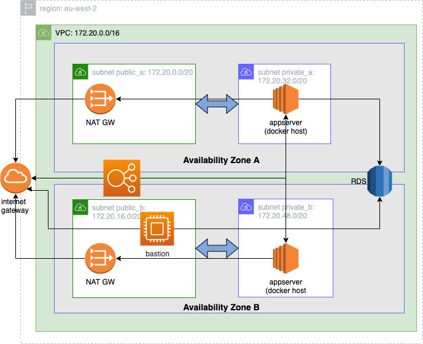

<p><a target="_blank" href="https://app.eraser.io/workspace/RpEhDJtrAR4DlXmXeGbH" id="edit-in-eraser-github-link"></a></p>

This experimental project creates a fault tolerant infrastructure for web applications and deploys rails app [https://expo.stimulusreflex.com/](https://expo.stimulusreflex.com/). Infrastructure is provisioned with terraform while resource configuration is done with ansible. The webapp runs in docker containers and has a dependency on a postgres db.

---

Please don't omit reading the [notes](#notes) section.

# Installation


Setup your awscli with a user that has permissions to create vpc, ec2 and rds resources. 

We will use terraform input vars for:

- the RDS db credentials
- the public ssh key for aws_key_pair.
Create file **tf.vars** with the following:

```
# tf.vars
db_username = "your-username"
db_password = "lockdown"
public_key= "very-long-string-with-your-ssh-public-key-goes-here"
```
Next step is to execute the terraform plan

```bash
# from project root
cd terraform

# create plan
terraform plan -out tf.plan -var-file=tf.vars

# apply
terraform apply tf.plan
```
The aws infrastructure has now been provisioned and an ansible inventory file has been created. See file terraform/[output.tf](http://output.tf/) for more info.

### Configure the bastion
From now on everything will be done with ansible. Ensure you have a working ansible installation and execute `ansible-galaxy collection install community.general`to install a module collection we will use in some tasks.

Next step is to configure the bastion host. We will install a few network utilities that will help us with debugging . Ensure your ssh key has been added to the ssh agent (ssh-add -k) and then execute the playbook for the bastion. 

```bash
# from project root
cd ansible
ansible-playbook bastion.yml
```
### Create and configure the database
Next step is to create the database, the webapp user and the database tables. These playbooks will be executed on the bastion. 

```bash
# create db
ansible-playbook db_create.yml

# prepare with `rails db:prepare`
ansible-playbook db_prepare.yml
```
### Configure the app servers
We will install the docker daemon in the appserver group. The bastion is used a jump host.

```bash
ansible-playbook app-servers.yml
```
### Deploy the app
Time to deploy the app. We will build and push the image to docker hub and then with a playbook we will spin up containers. The image deployed will be tagged with the SHA of the latest commit in current git branch.

The playbook also executes the rails migration.

```bash
# from project root
cd webapp_stimulus_reflex_expo

# login to docker hub so we can push the image
docker login

# build and push image
make publish

# run the migration and spin up containers
cd ../ansible
ansible-playbook deploy.yml
```
## Notes
- This project was an excuse to get my hands dirty with ansible.
This is the first time I've used ansible. I am sure my implementation looks horrible.
- My time was split 90% ansible and 10% for all the rest.
- The most notable flaw in this implementation is that I have not used ansible vault for encrypting the db credentials for the webapp.
- The infrastructure is fixed, with two appservers. An alternative implementation would be the use of an Autoscaling Group and baked AMI images.
- Terraform scripts are not modular/configurable
- Things I would improve for the rds db:
    - enable multi-az.
    - Put the db in a separate private subnet and protect it further with a NACL.
- I would like to setup a VPN endpoint to make accessing the aws resources a bit easier.
- There is no CI/CD, rolling deployments or other fancy stuff.
- Instead of terraform another interesting option for aws infra would be pulumi.
- Finally, I would never use this setup in real life. Instead, I would use a k8s cluster. It is much more fun!
[View on canvas](https://app.eraser.io/workspace/RpEhDJtrAR4DlXmXeGbH?elements=SLVHPq8HpLyHnw_f8KXHyw) 


<!--- Eraser file: https://app.eraser.io/workspace/RpEhDJtrAR4DlXmXeGbH --->